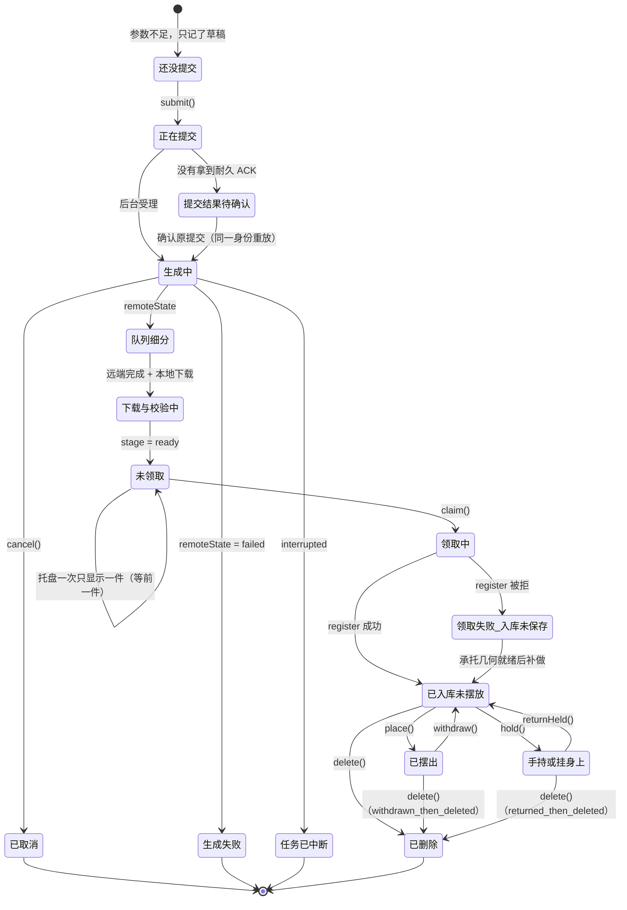

# 「我的物件」= 全部许愿的目录（一页设计）

用户原话：

> **「没领取也应该在这个列表，写着未领取啊」**
> **「你先做好这个列表的设计」**

这一页只做设计，**不含生产代码**（最多给伪代码与类型草图）。它要回答一件事：
`摆放 → 我的物件` 这个列表，怎么成为**「你许愿过 / 拥有过的所有东西」的目录**，
每行一句看得懂的状态，动作能在那一行就地做。

涉及但**只读**的既有实现：`Presence/ResidentPropEditorState.swift`、
`Presence/ResidentPropPlacementService.swift`、`VisualEngine/ResidentPropEditorView.swift`、
`Presence/WishMachineCoordinator.swift`、`Presence/WishMachineTaskPresentation.swift`、
`Presence/WishMachineOutputDescriptor.swift`、`Agent/ResidentPropToolBridge.swift`、
`Agent/ResidentWishMachineTools.swift`、`tools/reconcile-generation-results.py`。

本轮**不碰**：`apps/macos/**`、`services/**`、`Makefile`、`tools/**` 的既有文件。

---

## 0. 先看现场：这不是推测，是真机上已经发生的事

2026-10-02 13:30 读**当前这台机器**的两份权威（只读命令）：

| 权威 | 事实 |
| --- | --- |
| `~/Library/Application Support/gmgn radio/WishMachine/wishes.json` | **7 条 job**：5 条 `stage=claimed`（咖啡机 / 暖光落地灯 / 斧头 / 2B 白色长剑 / 超大荧幕电视）、2 条 `stage=ready`（超大荧幕电视 ×2） |
| `…/ai.gmgn.radio/LivingWorld/marble-living-cabin/1.2.0/state.json` | `objectStates` **只有 2 条**（斧头、咖啡机，两条都 `isEnabled=true`）；`propTombstones` 空；`heldProp` 空 |
| 同一份 `state.json` 的 `layoutReceipts` | 恰好 2 个入库回执：`claimed.02BFEE6E-…`、`claimed.EBFC07BE-…` |
| 跨全部 `LivingWorld/*/state.json` 搜另外 5 个 `objectID` | **一个都搜不到**（既不在 `objectStates`，也不在 `propTombstones`） |

**结论：今天的「我的物件」列表显示 2 行，而用户许愿过 7 件。**
其中 2 件是「未领取」（`.ready`，从来没进过这个列表 —— 因为它只读库存记录），
另外 3 件是「已领取但没写进库存」（正是 `ResidentPropInventoryBacklog` 存在的理由，
`App/GMGNRadioApp.swift:7731-7745`）。

用户那句抱怨，就是这张表。

---

## 1. 每一行是什么：以什么为主键

### 结论

**一行 = 一次许愿委托（`jobID` 为主键），并绑定它产出的物件（`objectID`）；两者用正向比对连起来，绝不反解。**

```
OwnershipRowKey = (jobID: UUID?, objectID: String?)
```

| 键 | 权威拥有者 | 它唯一能回答的问题 |
| --- | --- | --- |
| `jobID`（`WishMachineJob.id`） | `wishes.json`（`WishMachineCoordinator.swift:9-45`） | 还没提交 / 正在提交 / 生成中 / 生成完成待领取 / 生成失败 / 已取消 / 中断 |
| `objectID`（`"wish-prop-…"`） | 世界文档（`WorldObjectState` / `WorldPropTombstone` / `heldProp`，`WorldState.swift:53-79`） | 已入库未摆放 / 已摆出 / 手持或挂身上 / 已删除（墓碑） |

### 为什么不能二选一，也不能假设一一对应

代码与真机都证明 job ↔ objectID **不是一一对应**：

1. **正向铸造是一一对应的**：`objectID = "wish-prop-" + job.id.uuidString.lowercased()`，
   与 job 同一次写入（`WishMachineCoordinator.swift:545-551`）。所以 **job → objectID 是函数**。
2. **反向不是**：历史的 `objectID` 短命名存在（`wish-prop-ebfc07be`，
   `tools/test-resident-prop-capability.swift:51`；`wish-prop-2f633c0f`，
   `tools/test-resident-screen-overlay.swift:804`），从 8 位十六进制**推不出** `jobID`。
   ⇒ **禁止**用 `objectID.dropFirst("wish-prop-".count)` 反查 job。
3. **有 job 无 object**：`.failed` / `.cancelled` / `.interrupted` 的 job 早已铸出 `objectID`
   （`:545-549`），但世界里从来没有这条记录。
4. **有 object 无 job**：库存里带 `generatedProp` 但 `sourceWishID` 对不上任何 job
   （旧档案、`tools/world-migration` 的迁移语料、手工导入）。
5. **有 object 但已删**：删除后 `objectStates` 里没有它，只剩 `propTombstones[objectID]`
   （`WorldPropDeletion.swift:9-16` 的三条纪律：**行留下来**）。
6. **一个 job 的产物可能没进世界，也可能进两次**：入库是**独立**于 job 的世界命令
   （`GMGNRadioApp.swift:4401`，`requestID = "claimed." + job.id.uuidString`），
   而 history 里 `wishes.json` 的 stage **从不因为入库成功或物件被删而回写**。

### 连接的判据（唯一一处，两条腿）

```
job ⇄ object 匹配：
  ① job.objectID == object.generatedProp.objectID          // 主判据（铸造时就是它）
  ② job.id.uuidString == object.generatedProp.sourceWishID // 第二线索，只在 ① 失配时用
```

两条都失配 ⇒ 这是一行**孤儿**（有 object 无 job），照常显示，名称与状态从世界事实派生，
展开里明写「找不到对应的许愿记录」。**绝不因为找不到 job 就把这行藏起来** ——
那正是"东西不见了"的观感来源。

### 代价（明说）

- 列表要做一次 **full outer join**（jobs × objectStates × tombstones × layoutReceipts），
  不能像今天这样只读一边（`GMGNRadioApp.swift:4563`）。
- 孤儿行没有过程信息（没有 `stage`、没有失败原因），只能显示归属事实。
- 需要给孤儿一个确定性的排序键（`objectID` 字典序），否则每次渲染顺序会抖。

---

## 2. 状态机：一个许愿从想法到摆在房间里

### 2.1 状态机图（mermaid）



`队列细分` = 三种**同一阶段的具名进度**，不是一个新状态：
`排队中`（`.generating` + `remoteState ∈ {queued, submitting, remotePending}`）、
`检查生成输入`（`.preflight`）、`等待生成资源`（`.waitingResources`）。
判据逐字来自 `GMGNRadioApp.swift:6430-6436`。

### 2.2 主状态清单（互斥，一行只显示一句）

按**优先级从高到低**取第一个命中。左列是状态 ID（设计用，不进任何存档），
中列是用户可读文案（中文短句），右列是**权威字段**。

| # | 状态 ID | 用户文案 | 权威字段（唯一来源） |
| --- | --- | --- | --- |
| 1 | `deleted` | 已删除 | `WorldState.propTombstones[objectID]`（`WorldState.swift:70`、`WorldPropDeletion.swift:24-66`） |
| 2 | `held(slot)` | 拿在手里 / 挂在背后 / 挂在腰间 | `WorldState.heldProp?.objectID == objectID`，文案取 `heldProp.hand`（`WorldPropLayout.swift:198-202, 242-262`） |
| 3 | `placed` | 已摆出 | `objectStates[objectID].generatedProp != nil` **且** `isEnabled == true` |
| 4 | `inInventory` | 已入库，尚未摆放 | `objectStates[objectID].generatedProp != nil` **且** `isEnabled == false` |
| 5 | `claiming` | 已领取，正在入库 | `job.stage == .claimed`、不在 `objectStates`、`inventoryPending == nil`、`claimReceipt == nil` |
| 6 | `inventoryBlocked(reason)` | 已领取，入库尚未保存：<原话> | `job.stage == .claimed` **且** `residentPropInventoryBacklog[objectID] != nil`（`GMGNRadioApp.swift:7746-7760`） |
| 7 | `ready(onTray:)` | 未领取（`onTray == false` 时后缀「· 还没上托盘」） | `job.stage == .ready` + `layoutReceipts` 里没有 `claimed.<jobID>` + `objectStates` 里没有它 |
| 8 | `renderFailed(message)` | 生成完成，场景加载失败 | `outputRenderFailure(id:…)` 事件（`WishMachineCoordinator.swift:576-594`） |
| 9 | `cancelPending` | 取消请求处理中 | `job.cancelRequested == true` **且** `stage ∈ {submitting, submissionUncertain, generating, generated}`（`GMGNRadioApp.swift:6510-6513`） |
| 10 | `failed(message)` | 生成失败 | `job.stage == .failed`（`lastError` 是原因） |
| 11 | `cancelled` | 已取消 | `job.stage == .cancelled` |
| 12 | `interrupted` | 任务已中断 | `job.stage == .interrupted` |
| 13 | `submissionUncertain(message)` | 提交结果待确认 | `job.stage == .submissionUncertain`（`WishMachineCoordinator.swift:5-7`） |
| 14 | `submitting` | 正在提交 | `job.stage == .submitting` |
| 15 | `queued(detail)` | 后台排队中 / 检查生成输入 / 等待生成资源 | `job.stage == .generating` + `job.remoteState`（`GMGNRadioApp.swift:6430-6436`） |
| 16 | `generating` | 生成中 | `job.stage == .generating`（其余 `remoteState`） |
| 17 | `downloading` | 下载与校验中 | `job.stage == .generated` |
| 18 | `draft(needs)` | 还没提交：还缺尺寸 | `wishes.json` 的 `pendingDrafts[]`（`WishMachineCoordinator.swift:111-143`） |

**「领取失败」是两个不同的状态，不许合并成一句**：

- **人没走到 / 托盘没显示** ⇒ `claim()` 抛 `notAtMachine`（`WishMachineCoordinator.swift:788-790`），
  `job.stage` **仍然是 `.ready`** ⇒ 主状态还是 **#7 未领取**，副行写
  「还没走到许愿机，或托盘上还没有它」（原因取自 `WishMachineError.notAtMachine` 的原话）。
- **入库被摆放服务拒** ⇒ `job.stage` 已经是 `.claimed` 但世界记录没写进去 ⇒ 主状态 **#6**，
  副行写服务给出的**原话**（例如 `environmentNotReady` 的「空间碰撞数据尚未准备好，请稍后再摆放。」）。

### 2.3 叠加徽标清单（非互斥，最多显示 2 枚，其余进悬停）

| 徽标 | 文案 | 权威字段 |
| --- | --- | --- |
| `assetNotReady` | 资产未就绪 | `residentPropAssetFailures[objectID]`（`GMGNRadioApp.swift:3773`、`:4592-4593`） |
| `noWishRecord` | 无许愿记录 | 匹配两条腿都失配 ⇒ 孤儿行 |
| `waitingForPlacement` | 等待摆放 | `delegations[].state == .pending`（`WishMachineCoordinator.swift:145-147`） |
| `placementFailed` | 摆放失败 | `delegations[].state == .failed`，原因 `delegations[].lastError` |
| `placementStopped` | 摆放已停止 | `delegations[].state == .revoked` |
| `autoPaused` | 自动续办已停 | `job.autoContinuationPaused == true`（**全局**开关的输入，不当作按行控件，见 `WishMachineTaskPresentation.swift:240-252`） |

连通性**不是徽标**：它是一条全局横幅（`ResidentConnectivityFact`，
`WishMachineTaskPresentation.swift:200-238`），列表不重复它。

---

## 3. 状态的唯一来源：`状态 = f(权威)`

### 3.1 字段映射表（每一个状态由哪个权威字段推导）

| 状态的输入 | 权威文件 / 结构 | 精确字段 | 读它的既有代码 |
| --- | --- | --- | --- |
| 过程阶段 | `wishes.json` → `Archive.jobs[]` | `WishMachineJob.stage`（9 个字面量） | `WishMachineCoordinator.swift:5-7, 9-45` |
| 远端进度 | `wishes.json` → `jobs[].remoteState` | `PropGenerationState` | `GMGNRadioApp.swift:6430-6436` |
| 未提交草稿 | `wishes.json` → `pendingDrafts[]` | `needs[]` / `attempt` / `isExpired` | `WishMachineCoordinator.swift:111-143, 636-641` |
| 失败原话 | `wishes.json` → `jobs[].lastError` | `String?` | `GMGNRadioApp.swift:6422` |
| 摆放委托 | `wishes.json` → `delegations[]` | `state` ∈ {awaitingSubmission, pending, placed, revoked, failed} | `WishMachineCoordinator.swift:145-166` |
| 场景加载失败 | `wishes.json` → `events[]` | `kind == .failed && failureSource == "renderer"` | `WishMachineCoordinator.swift:576-580` |
| 在库存 / 已摆出 | 世界文档 | `objectStates[objectID].generatedProp` + `.isEnabled` | `WorldState.swift:78`、`GMGNRadioApp.swift:6463-6476` |
| 入库回执（幂等键） | 世界文档 | `layoutReceipts["claimed.<jobID>"]` | `WorldState.swift:56`、`GMGNRadioApp.swift:4401` |
| 已删除（墓碑） | 世界文档 / Rust `world_records` | `propTombstones[objectID]`（`tombstone=1` + `object.removed` 事实） | `WorldState.swift:70`、`WorldSimulation.swift:332-344`、`services/gmgn-taskd/src/world.rs:112-119` |
| 手持 / 挂点 | 世界文档 | `heldProp.objectID` + `heldProp.hand` | `WorldState.swift:58`、`WorldPropLayout.swift:242-262` |
| 尺寸（唯一一份） | 世界文档 | `WorldGeneratedProp.effectiveSize` | `WorldPropLayout.swift:89-92` |
| 尺寸出处 | 世界文档 | `WorldGeneratedProp.sizeProvenanceSummary` | `WorldPropLayout.swift:104-125` |
| 资产未就绪 | **会话内内存**（不是权威） | `residentPropAssetFailures[objectID]` | `GMGNRadioApp.swift:3773, 4017-4022, 4385` |
| 入库未保存 | **会话内内存**（不是权威） | `residentPropInventoryBacklog[objectID]` | `GMGNRadioApp.swift:4424-4431, 7746-7760` |
| 托盘是否显示它 | **会话内内存** | `spatialStage.wishMachineOutput?.id` + `wishMachineOutputStatus` | `GMGNRadioApp.swift:6195-6197, 6371-6375` |
| 两轴（归属 / 摆放） | 由上面派生 | `ResidentTaskAxisProjection.project(...)` | `WishMachineTaskPresentation.swift:90-198` |

### 3.2 `状态 = f(权威)` 的函数签名草图

```swift
// ── 输入：一行需要的**全部**事实。没有一项是"上一版列表算出来的"。 ──
struct OwnershipRowFacts: Sendable {
    // 过程权威：wishes.json（WishMachineCoordinator.Archive）
    var job: WishMachineJob?
    var draft: WishMachinePendingDraft?
    var delegation: WishPlacementDelegation?
    var renderFailure: WishMachineEvent?
    // 归属权威：世界文档（WorldState；落盘在 state.json / 权威 world_records）
    var object: WorldObjectState?
    var tombstone: WorldPropTombstone?
    var heldSlot: WorldPropSlot?              // heldProp?.objectID == 本行时才有值
    var claimReceipt: WorldPropLayoutCommand? // layoutReceipts["claimed.<jobID>"]
    // 会话内事实（**重启/换世界会消失**，只用来解释"现在为什么不能动"）
    var assetFailure: String?
    var inventoryPending: ResidentPropInventoryBacklog.Pending?
    var trayShowsThis: Bool
}

struct OwnershipRowKey: Hashable { let jobID: UUID?; let objectID: String }

/// **唯一**推导。纯函数：同输入同输出，不读时钟、不读磁盘、**不写任何东西**。
/// 视图、任务行、agent 的 read_owned_props、对账器都从这里取状态文案。
func ownershipRow(_ facts: OwnershipRowFacts) -> OwnershipRow

struct OwnershipRow {                       // 只读投影：**不实现 Codable、不落盘**
    let key: OwnershipRowKey
    let name: String                        // object.displayName ?? job.name
    let state: OwnershipRowState            // §2.2 的 18 个之一
    let badges: [OwnershipRowBadge]         // §2.3 的叠加徽标
    let sizeText: String?                   // "最长边 1.10 m"（effectiveSize 唯一出口）
    let actions: [OwnershipRowAction]       // 由 state 派生，**不由调用点 if/else 决定**
    let evidence: [OwnershipEvidence]       // 「这句话的出处」：字段名 + 值
}
```

### 3.3 「绝不另存一份列表状态」怎么落实（六条纪律）

1. **没有 `OwnershipListStore`。** 列表是 `worldState × wishArchive × sessionFacts` 的
   **纯函数结果**；由一个 `@Published` 的 revision（`WorldState.revision`/`layoutRevision`
   + `wishes.json` 的写入计数）驱动重算。
2. **类型上写不出"存下来"**：`OwnershipRow` / `OwnershipRowState` **不实现 `Codable`**，
   没有 `init(rawValue:)`，不进 `wishes.json`、不进 `state.json`、不进 `UserDefaults`。
3. **明确禁止的四种回写**（这正是这两天反复出事的形状）：
   - ❌ 给 `WishMachineJob` 加一个 `var listState: String` 并写进 `wishes.json`；
   - ❌ 把状态塞进 `WorldObjectState.metadata`；
   - ❌ 把派生结论写成一条 `layoutReceipts` 回执；
   - ❌ 把"上次看到的状态"缓存进 `UserDefaults` 供离线显示。
4. **只能"读不到"，不许"沿用上一次"**：读不到权威 ⇒ 那一行（或整个列表）显示
   「读不到记录」，**绝不**显示上一次的值。今天已经有这条纪律的样板：
   `refreshSnapshot` 返回 `nil` 与"返回一份承托面为空的现状"是两件互斥的事实
   （`ResidentPropEditorState.swift:186-194`）。
5. **单调轴复用既有投影，不另写 `if`**：归属轴「只前进」由
   `ResidentOwnershipAxis.advance`（`WishMachineTaskPresentation.swift:44-46`）保证，
   摆放轴看**推进后**的归属（`:146-149`）。列表直接用 `project(...)` 的结果，
   **不许**自己再判一次"算不算已入库"。
6. **收敛目标（本次设计点名，实现时可分两步走）**：
   今天有**两套**状态文案 —— `ResidentTaskAxisProjection.currentStatus`
   （`WishMachineTaskPresentation.swift:178-188`）与 `ResidentPropInventoryBacklog.status`
   （`GMGNRadioApp.swift:7780-7783`），而 `wishMachineTaskPresentation` 里还有一层
   `status` 字面量（`GMGNRadioApp.swift:6428-6509`），**三套**。
   `ownershipRow` 必须成为它们**共同的**文案出口；合并之前，先加一个
   "同一份事实 → 同一句话"的断言测试把三者钉在一起。

---

## 4. 每一行提供什么动作：动作 → 既有路径表

| 动作 | 出现条件（由 `state` 派生） | 既有路径（文件:行号） | 有 / 缺 |
| --- | --- | --- | --- |
| **领取** | `ready` + 托盘已显示 + 居民在取物点 | `WishMachineCoordinator.claim(id:worldID:residentScope:)` — `WishMachineCoordinator.swift:783-795`；证据由 `canClaim` 提供 — `GMGNRadioApp.swift:3711, 6186-6205`；agent 工具 `claim_wish_output` → `claimWhenArrived` — `ResidentWishMachineTools.swift:721-742` | **缺口：用户面无入口**。今天**只有 agent 能领**（工具名单 `ResidentWishMachineTools.swift:51`）。而且 `claim` 被三条硬门槛卡住：`evidence.activityID == "wish_machine.collect"`、`distanceMeters ≤ 0.25`、`outputAvailable`（`WishMachineCoordinator.swift:788-790`） |
| **重试** | `submissionUncertain`（可选 `submitting` / `generated`） | `WishMachineCoordinator.retry(id:…)` — `WishMachineCoordinator.swift:658-689`；guard 在 `:670` | **已有（agent）**；用户面缺。**缺口：`.failed` 不能重试** —— `:670` 的 guard 只放行 `[.submissionUncertain, .submitting, .generated]`，`.failed` 抛 `retryUnavailable`（`:206`）。所以"失败行上的重试"今天**不存在**，要么新增一条"重新生成"（新语义、新授权），要么明说"失败不能重试，请重新许愿" |
| **取消** | `submitting` / `submissionUncertain` / `generating` / `generated` | `WishMachineCoordinator.cancel(id:…)` — `WishMachineCoordinator.swift:769-781` | 已有（agent `cancel_wish_generation`，`:51`）；用户面缺 |
| **摆放** | `inInventory` / `inventoryBlocked` 补做后 | 点行 → `ResidentPropEditorState.select` → `preview`/`commit` — `ResidentPropEditorState.swift:402-475, 663-666`；世界命令 `.place` — `WorldPropLayout.swift:266` | 已有：面板点行（`ResidentPropEditorView.swift:41`）即进携带态，落点在 3D 里用鼠标做 |
| **收回** | `placed` | `ResidentPropEditorState.withdraw()` — `:737-742`；UI 按钮 — `ResidentPropEditorView.swift:89` | 已有 |
| **拿着看 / 换挂点** | `inInventory` | `holdSelected(at:)` — `ResidentPropEditorState.swift:761-791`；UI — `ResidentPropEditorView.swift:87, 175-188` | 已有（逐挂点可用性已修，`:335-344`） |
| **放回** | `held` | `returnSelected()` — `ResidentPropEditorState.swift:792-797` | 已有 |
| **删除** | 任何非 `deleted` 行 | `deleteSelected(reason:)` — `ResidentPropEditorState.swift:749-754`；确认框 — `ResidentPropEditorView.swift:159-168`；agent `delete_prop` — `ResidentPropToolBridge.swift:220-228`；世界命令 `.delete` — `WorldPropLayout.swift:292-300` | 已有（面板与 agent **同一条**世界命令） |
| **查看失败原因** | `failed` / `renderFailed` / `inventoryBlocked` / `assetNotReady` | 事实已在：`job.lastError`、`outputRenderFailure.message`、`inventoryPending.reason`、`assetFailure`；今天只在**任务行** detail 显示 — `GMGNRadioApp.swift:6496-6503` | 事实**已有**；**缺口：列表里没有展示位** |
| **撤销上次** | `snapshot.canUndo` | `ResidentPropEditorState.undo()` — `:755-760`；UI — `ResidentPropEditorView.swift:143` | 已有（**面板级**，不是行级；设计上保持面板级） |
| **恢复自动续办** | `autoPaused` | `WishMachineCoordinator.resumeContinuations` — `:845-890`；唯一全局动作 `WishMachineTaskPresentationStore.resumeAutonomy` — `WishMachineTaskPresentation.swift:409-421` | 已有，且**刻意不按行**（一个开关、不需要按任务逐个恢复）。列表**不许**给它加按行按钮 |

**缺口汇总（别假装有）**：

- **G1 用户面领取入口不存在。** 最大的一条。而且不是"接根线"就完事 ——
  `claim` 的判据要求居民**真的在取物点**。要么按钮置灰并引导（零新语义），
  要么新增一条"人类命令"通道（新语义，且与既有 fail-closed 判据冲突，见 §10 Q4）。
- **G2 `.failed` 不能重试**（`WishMachineCoordinator.swift:670`）。
- **G3 用户面没有取消/重试入口。**
- **G4 列表没有"查看失败原因"的展示位**（事实有、界面没有）。
- **G5 删除不写回 `wishes.json`**：删完 `job.stage` 仍是 `.claimed`。
  列表必须靠 `propTombstones` 才知道它被删了；靠 job 一定漏。
- **G6 `wishes.json` 是整份 decode**（`WishMachineCoordinator.swift:269-287`）：
  一条坏 job 会让**整份读不出来**（`readable = false`），与"局部降级"的要求直接冲突。

---

## 5. 排序与分组

### 结论

**默认：状态优先分组，组内按最近倒序。** 四个固定顺序的组：

| 组 | 收哪些状态 | 为什么在这一组 |
| --- | --- | --- |
| **① 待你处理** | `ready`（未领取）、`inventoryBlocked`、`claiming`、`failed`、`submissionUncertain`、`renderFailed`、`placementFailed`、`draft` | 这一组是**唯一需要用户动手的**。打开列表的第一意图就是"我许愿的东西怎么样了" |
| **② 在库里** | `inInventory`（含 `assetNotReady` 徽标） | 拿到了、还没摆 |
| **③ 在房间里** | `placed`、`held(slot)` | 已经在那儿了，看一眼就够 |
| **④ 已结束** | `deleted`（默认折叠）、`cancelled`、`interrupted` | 历史，不占主视线 |

组内排序：`updatedAt` 倒序 —— 有 job 用 job 的最近事件时间，
没有 job（孤儿）用 `objectID` 字典序（**确定性优先于"感觉上的新"**）。

### 为什么不是纯按时间
一件 3 天前失败的任务会永远压在列表最上面，而用户每次打开要的是"现在有什么要我管"。
状态优先 + 组内时间，两个意图都满足。

### 搜索 / 筛选：首版建议**不做**

理由（三条，都是代价而不是偏好）：

1. **物理上放不下**。列表区 `maxHeight` 是 145 pt（`ResidentPropEditorView.swift:63`），
   面板宽 340 是红线（`StageWindowController.swift:1212`）。再塞一个搜索框 ⇒ 可见行数 < 3。
2. **筛选就是第二份"什么算可见"的真相**。"这行算不算可见"必须只有一处
   （`ownershipRow`）。加筛选器会让"列表为空"这句话有两个含义（真的没有 / 被筛掉了）。
3. **件数还小**。真机今天 7 件，其中 4 组各 1–3 条。
   等「已结束」超过 ~20 件时再加 —— 而那时正确的做法是**分页 / 折叠**，不是搜索。

---

## 6. 空态与错误态

### 6.1 空态文案

| 处境 | 文案 | 说明 |
| --- | --- | --- |
| 当前世界不是许愿机那个世界 | **整块面板不出现** | 既有行为：`GMGNRadioApp.swift:4630-4631` 的 guard，保持 |
| 这个空间里一件都没许愿过 | 「还没有许愿。对居民说你想要什么，做好后会出现在这里。」 | 今天那句（`ResidentPropEditorView.swift:34`）是「领取许愿机的物件后，可以在这里摆放」—— 那是**在教流程**，不是空态；而且它假设了"你得先去领"，正好是用户抱怨的那个假设 |
| 切到「房间里」且一件没摆 | 「房间里还没有摆放物件」 | 保留既有文案（`ResidentPropEditorView.swift:34`） |
| 「已结束」组为空 | 整组不显示 | 不显示「已结束 (0)」 |

### 6.2 错误态：**局部降级，绝不整列表消失**

| 坏掉的东西 | 列表怎么表现 | 文案 |
| --- | --- | --- |
| `wishes.json` 整份读不出来（`readable == false`，`WishMachineCoordinator.swift:287`） | **仍然显示**库存与已摆出的行（它们来自世界状态，不依赖 `wishes.json`），顶部一条横幅 | 「许愿记录读不出来，下面是房间里已经有的东西。许愿任务的处理已停止，以免覆盖记录。」（沿用 `WishMachineError.unavailable` 的原话） |
| **单条 job 解码坏了** | 只那一行降级成一行提示，其余照常 | 「这条许愿记录损坏（`jobID …`），已跳过；物件本身如果还在，下面另有一行。」← **需要先改 `wishes.json` 为逐条解码**（见 G6） |
| 某条 `generatedProp` 非法（`isValid == false`，`WorldPropLayout.swift:126-141`） | 那一行说"不能摆放"，**其余行照常** | 「这件物件的记录损坏，不能摆放：<具体字段>」 |
| 世界状态读不到（换世界中 / 世界文档损坏） | 进入"读不到"态并说明；**不显示上一次的内容** | 「读不到这个房间的物件记录，请稍后重开摆放面板。」 |
| 承托几何拿不到（`supportGeometryUnavailable`） | **不影响列表**（列表不读几何）；只有"点行进携带态"那一步会拒绝 | 既有两句，一个字不改：`ResidentPropEditorSnapshot.supportDerivingText` / `supportUnavailableText`（`ResidentPropEditorState.swift:181-183`） |
| 后端连不上（`PropGenerationStore.errorMessage`） | **不影响列表**；连通性走全局横幅 | `ResidentConnectivityFact.bannerText`（`WishMachineTaskPresentation.swift:216-219`） |

**关键纪律**：一个 job 坏了，列表**不能整个消失**。"东西不见了"正是这次要修的观感缺陷。

---

## 7. 失败 / 删除的展示

### 7.1 失败：**留在列表里**，而且文案带**字段与数值**

- **留在列表**（不隐藏、不折叠进"已结束"）。理由：失败任务一旦消失，用户唯一的证据就没了 ——
  那正是"消失了"这个抱怨的来源。失败进 **① 待你处理** 组。
- **文案遵守刚定的具名纪律**：一句摘要写**字段 + 实测值 + 期望**，不写"生成失败"这种无信息量的话。
  本仓已经有这条纪律的样板：`WishMachineDimensionRejection.summary`
  = `"\(field) = \(value)，期望 \(expected)"`（`WishMachineOutputDescriptor.swift:224-251`），
  真机那台电视真正的字段就是 `size_intent.longest.meters = 1443`（单位错了 1000 倍）。
- 列表一行只放**摘要**（`lineLimit(1)`），完整原因在悬停与展开里（见 §9）。
- 出处逐字来自：`job.lastError`、`outputRenderFailure.message`、
  `inventoryPending.reason`、`assetFailure`。**不许**列表自己造一句更"友好"的话。

### 7.2 已删除：建议**默认折叠进「已结束」并显示计数**，不是完全隐藏

- 「已结束 · 3」一个折叠行；展开后每行写
  「已删除 · 原本在库存里 / 原本摆放在房间里 / 原本拿在手里（先放回再删）」
  —— 结算文案取 `WorldPropDeletionSettlement.summary`
  （`WorldPropDeletion.swift:90-97`，唯一一份），理由取 `tombstone.reason`。
- **为什么不完全隐藏**：墓碑是"有意删除"与"意外丢了"唯一分得开的地方
  （`WorldPropDeletion.swift:9-16` 的第 1 条纪律），也是 Rust 权威
  `world_records.tombstone=1` + `object.removed` 事实在用户面前的可见面。
  隐藏它 = 把这两件事在用户面前重新变得不可分，方向与本仓已经付过的代价相反。
- **为什么不平铺**：用户要的是"我有什么"，不是"我删过什么"。删除是**永久**的，
  不能恢复（`ResidentPropEditorState.swift:850-853`），平铺会让它读起来像一个可操作的对象。

---

## 8. 与另外两处的三向一致性

### 8.1 三处各读什么（现状）

| 面 | 读什么 | 代码 |
| --- | --- | --- |
| 「房间里」列表 | `objectStates` 里 `isEnabled == true`（+ 手持那一件） | `ResidentPropEditorState.swift:284-288` |
| 托盘（3D 出货口） | `spatialStage.wishMachineOutput`，由 `readyOutputs` 喂 | `WishMachineCoordinator.swift:797-810`、`GMGNRadioApp.swift:6371-6375` |
| 任务行（「许愿任务」） | `jobs.suffix(20)` + 世界读回 | `GMGNRadioApp.swift:6389`、`6418-6537` |

### 8.2 六种可能分叉的情形，与怎么处理

| # | 分叉形状 | 为什么 | 处理 |
| --- | --- | --- | --- |
| F1 | 任务行说「可领取」，托盘上却没有 | **托盘一次只显示一件**（`ready.first`，`GMGNRadioApp.swift:6371-6375`），而 `.ready` 的 job 可以有多件 | 列表把没上托盘的那件标成「未领取 · 还没上托盘」。判据与任务行**同一份**（`GMGNRadioApp.swift:6442-6449` 已经区分「等待托盘展示」/「可领取」） |
| F2 | 任务行看不见某条 job，列表里还有 | 任务行窗口是**最近 20 条**（`:6389`），列表读全部 | **有意的**：任务行是**通知**，列表是**目录**。列表管全部，并在展开里明说"任务面板只显示最近 20 条" |
| F3 | 任务行 30 秒后消失，列表还在 | 终态任务靠 `promptExpiresAt` 过期（`StageOverlayView.swift:120-123`） | **有意的**，必须在代码注释里写死这条差别，否则下一个人会当 bug 修掉。列表**绝不**引入任何过期 |
| F4 | 「说已入库」与「列表里看得见」互相矛盾 | 历史缺陷：任务行读 `residentOwnedPropAssets`（模型已备好） | **已经修好**：两边都读 `objectStates`（`GMGNRadioApp.swift:6451-6466` 的长注释就是这个）。**这条要作为纪律保留** —— 任何一边改回读资产记录都是回归 |
| F5 | 手持那一件在「房间里」出现，任务行不出现 | 粒度不同，不是矛盾 | 保留。但**「已摆出」这个词在两处意思必须一模一样**（`isEnabled == true`），列表不许把"手持"也算"已摆出" |
| F6 | 删掉的物件：任务行**完全不说**，列表必须说 | 删除不回写 `wishes.json`（G5），job 还是 `.claimed` | 列表读 `propTombstones`（既有的 agent 面已经这么做了：`ResidentPropToolBridge.swift:249-264` 的 `deleted[]`） |

### 8.3 不分叉的两条结构性保证

1. **一个投影，五处消费**：`ownershipRow(facts:)` 是唯一的文案出口。
   任务行、列表、「房间里」、托盘、agent 的 `read_owned_props`
   （`ResidentPropToolBridge.swift:239-264`）都从它取状态。
2. **分叉要可见**：每行的展开里有 `evidence`（**字段名 + 值**），
   例如 `wishes.json stage = claimed` / `state.json objectStates = 没有` /
   `layoutReceipts[claimed.EBFC07BE-…] = 有`。于是分叉发生时用户与我们看到的都是
   "两个值不一样"，而不是一个盖住另一个。

对账器是同一件事的机器版：`tools/reconcile-generation-results.py`
（B-1 缺陷抓手：`wishes.json stage=claimed` ⇔ 权威里存在该条目，脚本头 `:1-40`）。
**列表与对账器必须给出同一个答案**，否则就说明投影错了。

---

## 9. 信息层级与 340 pt 排版

### 9.1 一行里放什么

```
[图标] 名称（1 行截断）
       状态 · 尺寸 · 来源            ← 副行，只在实际有内容时出现
       <失败/未入库原因摘要>          ← 第三行，仅在失败/受阻时出现，1 行截断
```

| 项 | 取哪个字段 | 为什么是它 |
| --- | --- | --- |
| 名称 | `WorldGeneratedProp.displayName`，没有就用 `job.name` | 世界那份是用户在房间里看到的名字；两处都有时**不许**分叉（`matchesIdentity` 已经把 `displayName` 算进身份，`WorldPropLayout.swift:176-181`） |
| 状态 | `row.state` 的一句（§2.2） | 唯一出口 |
| 尺寸 | `WorldGeneratedProp.effectiveSize` 的最长边 → 「最长边 1.10 m」 | **唯一出口**（`WorldPropLayout.swift:89-92`）。`job.heightMeters` 是"生成请求的高度"，**不是**这件的尺寸 —— 两者不同时显示世界那一份 |
| 来源 | `WorldGeneratedProp.sizeProvenanceSummary`（`WorldPropLayout.swift:115-125`） | 空间不够就移到展开里；不放在默认行 |
| 失败摘要 | §7.1，字段 + 数值 | 具名纪律 |

### 9.2 悬停展开什么

沿用既有做法（多行 tooltip，`StageOverlayView.swift:163` 的形状）：

```
2B 白色长剑 · 未领取 · 还没上托盘
最长边 1.10 m（按你说的尺寸 最长边 1.10 米）
wishes.json            stage = ready
state.json             objectStates = 没有这一条
layoutReceipts         claimed.4210DB95-… = 没有
task                   id = 4210DB95-…  objectID = wish-prop-4210db95-…
```

### 9.3 点击展开什么（选中后的下半部分）

今天选中之后那一段（`ResidentPropEditorView.swift:65-111`）只有
「拿着看 / 收回 / 挂点 / 删除 / 尺寸」。新增一块**只读事实**（`evidence` 三行，见上），
以及**由 `state` 派生的动作按钮**（§4）。

**行内不放按钮**：340 pt 宽度放不下"行内按钮 + 名称 + 状态"三样还要可读。
「领取」「重试」放在**选中后的动作区**（与「拿着看 / 收回」同一排的下一行）。

### 9.4 340 pt 下的排版草图（ASCII）

约束：面板宽 **340 pt（红线，不许改）** —— `StageWindowController.swift:1210-1213`；
左右 padding 16（`ResidentPropEditorView.swift:147`）⇒ **内容宽 308 pt**；
11 pt 中文字 ≈ **28 字/行**；列表区 `maxHeight` 今天 = **145**（`:63`）。

```
340 pt 面板 · 内容 308 pt · 11 pt 中文 ≈ 28 字/行 · 列表面板高 145（今天）
┌────────────────────────────────┐
│ 摆放                        ✕  │   ← 标题行
│ [ 我的物件 │ 房间里 ]          │   ← Segmented，labelsHidden（既有）
│                                │
│ 待你处理 (2)                   │   ← 组头，10 pt 半透明
│ ┌────────────────────────────┐ │
│ │ ⬇ 2B 白色长剑      未领取  │ │   ← 名称 1 行截断；状态右对齐 10 pt
│ │   最长边 1.10 m · 还没上托盘│ │   ← 副行 10 pt（仅需要时）
│ └────────────────────────────┘ │
│ ┌────────────────────────────┐ │
│ │ ⚠ 咖啡机          生成失败  │ │
│ │   targetHeight = 8.28，期望…│ │   ← 具名失败：字段 + 数值，1 行截断
│ └────────────────────────────┘ │
│ 在库里 (1)                     │
│ ┌────────────────────────────┐ │
│ │ ▣ 平面电视  已入库，尚未摆放│ │
│ └────────────────────────────┘ │
│ 在房间里 (1)                   │
│ ┌────────────────────────────┐ │
│ │ ✓ 咖啡机            已摆出  │ │
│ └────────────────────────────┘ │
│ ▸ 已结束 (1)                   │   ← 折叠行，默认收起
│                                │
│ ─────────────────────────────  │   ← 以下只在选中某行时出现
│ 拿着看  收回   [手│背后│腰间]  │   ← 既有动作区
│ 领取                           │   ← 仅「未领取」时出现
│ 删除                  最长边…  │   ← 既有（确认框在 `:159-168`）
└────────────────────────────────┘
```

**行预算（要如实说）**：组头 2×14 + 4 行 ×30 ≈ 148 > 145。
两个都不改红线的做法（择一，见 §10 备注）：
(a) 列表区高度 145 → **190**（**宽度 340 不动**，红线保住）；
(b) 首版只显示前两组 + 末行「还有 N 件」。
推荐 (a)：高度不是红线，而"看不见的列表"正是这次要修的病。

### 9.5 无障碍与既有约定

- 每行加 `accessibilityIdentifier("resident.ownership-row.\(key)")`，
  与既有 `resident.prop-editor.wall-placement`（`ResidentPropEditorView.swift:141`）同一风格。
- 图标承担语义（⬇ 未领取 / ▣ 在库里 / ✓ 已摆出 / ⚠ 失败 / ✕ 已删除），
  但**状态文案必须同时存在**，不能只靠图标与颜色 —— 真机上用户连着两轮问
  "这两个红色的是什么意思"（`ResidentPropEditorView.swift:112-114`）。

---

## 10. 需要用户拍板的问题（4 个）

### Q1 已删除的行：默认折叠，还是完全隐藏？

- **推荐：默认折叠进「已结束 (N)」，展开可见。**
- 代价：列表多一个折叠行；用户要再点一下才看得到删除历史。
- 备选 A：完全隐藏（列表最干净，但"有意删除"与"意外丢了"在用户面前重新不可分）。
- 备选 B：平铺（可见性最高，但删除是永久的、不可恢复，平铺会让它读起来像一个能操作的对象）。

### Q2 生成失败的行：留在「待你处理」，还是挪进「已结束」？

- **推荐：留在「待你处理」。**
- 代价：失败的旧任务会一直在第一组里占位，除非用户主动删掉它。
- 备选：进「已结束」（列表更干净，但失败是这个列表里**最需要被看见**的一件事 ——
  真机上已有两次"东西不见了"的投诉都起因于此）。

### Q3 列表范围：只当前世界，还是跨世界？

- **推荐：只当前世界**（与今天一致）。
- 代价：换到别的世界就看不到那件东西 —— 但「我的物件」这个面板本来就长在
  `WishMachineScene.worldID == 当前世界` 的守卫里面（`GMGNRadioApp.swift:4630-4631`），
  跨世界要做的是**新面板**，不是给这个列表加一列世界名。
- 备选：跨世界（要在每行加世界名，340 pt 下只剩 ~20 字可放名称与状态；
  而且"摆放"这个动作在别的世界里根本没有意义）。

### Q4 「领取」按钮够不到许愿机时怎么办？

- **推荐：按钮置灰 + 一句可读原因**（「先让居民走到许愿机领取位置，托盘上显示它之后才能领取」，
  沿用 `WishMachineError.notAtMachine` 的原话，`WishMachineCoordinator.swift:205`）。
  **零新语义**，`claim` 的三条判据一个字不改。
- 代价：用户点不动按钮，得先指挥居民走过去 —— 一次交互变成两次。
- 备选：新增一条"人类命令领取"通道，绕过 `distance ≤ 0.25 m` 与活动相位判据。
  代价：**这是放宽一条 fail-closed 判据**，而且"人在电脑前点一下"与"居民真的走到许愿机"
  在这个世界里是两件不同的事，混掉之后 `claim` 的语义（一次真实的到场）就没有了。

### 备注（不需要拍板，但请知情）

列表区高度今天 145 pt（`ResidentPropEditorView.swift:63`），四组 + 状态副行需要 ≈ 148。
建议提到 **190**（**宽度 340 不动**）。若不改，首版只能显示前两组 + 「还有 N 件」。

---

## 11. 读代码时发现的、与这份设计冲突的现状

| # | 现状 | 位置 | 冲突点 |
| --- | --- | --- | --- |
| C1 | **列表只读库存记录** | `ResidentPropEditorState.swift:284-288` 过滤 `item.generatedProp != nil`；快照来自 `context.state.objectStates.values.filter { $0.generatedProp != nil }`（`GMGNRadioApp.swift:4563`） | 未领取的 job、失败的 job、被删的物件**根本进不了这个列表**。这就是用户抱怨的那句 |
| C2 | **同步循环只处理 `.claimed`** | `GMGNRadioApp.swift:4051`：`.filter { $0.stage == .claimed }` | 列表若照它取数据源，未领取永远不在 |
| C3 | **同一件事有三套状态文案** | `ResidentTaskAxisProjection.currentStatus`（`WishMachineTaskPresentation.swift:178-188`）、`ResidentPropInventoryBacklog.status`（`GMGNRadioApp.swift:7780-7783`）、`wishMachineTaskPresentation` 里的 `status` 字面量（`GMGNRadioApp.swift:6428-6509`） | 列表若自己再写一套就是**第四套**。必须先收敛 |
| C4 | **`.failed` 不能重试** | `WishMachineCoordinator.swift:670` 的 guard 只放行 `[.submissionUncertain, .submitting, .generated]` | 设计里"失败行上的重试"今天**没有路径** |
| C5 | **删除不回写 `wishes.json`** | 删除走世界命令（`WorldPropLayout.swift:292-300`），`WishMachineJob.stage` 不动 | 列表靠 job 一定漏掉墓碑；必须读 `propTombstones` |
| C6 | **`wishes.json` 整份 decode** | `WishMachineCoordinator.swift:266-288`（一条坏 job ⇒ `readable = false`，整份读不出来） | 与"一个 job 损坏不能整列表消失"直接冲突。需要逐条解码 |
| C7 | **`objectID` 反解 `jobID` 会失败** | 短命名历史：`wish-prop-ebfc07be`（`tools/test-resident-prop-capability.swift:51`）、`wish-prop-2f633c0f`（`tools/test-resident-screen-overlay.swift:804`） | 主键设计必须用正向比对 + `sourceWishID` 兜底 |
| C8 | **托盘一次只显示一件** | `GMGNRadioApp.swift:6371-6375`（`ready.first`） | 多件 `.ready` 时，"可领取"与"托盘上有它"是两件事，必须分开说 |
| C9 | **任务行 30 秒过期** | `StageOverlayView.swift:120-123` + `pushWishTaskPrompts` 的 `promptExpiry`（`GMGNRadioApp.swift:6323-6328`） | 列表若照抄，用户又会看到"东西过期消失了" |
| C10 | **资产失败是会话内内存事实** | `residentPropAssetFailures`（`GMGNRadioApp.swift:3773`），换世界即清（`:4017-4022`） | 「已入库，资产未就绪」这条**跨会话不稳定**：重启后可能先没有、再在同步时出现。列表必须把它标成"暂时说不准"，不许当权威 |
| C11 | **没有用户面的领取/取消/重试入口** | 只有 agent 工具（`ResidentWishMachineTools.swift:51`）；`claim` 的调用者只有 `claimWhenArrived`（`:737`） | 与用户原话「动作要能就地做（例如在那一行"领取"）」直接冲突 —— 这是本次最大的功能缺口 |
| C12 | **用户面的 `rowStatus` 只有三种取值** | `ResidentPropEditorState.rowStatus(isHeld:isPlaced:)` → 手持中 / 已摆出 / 尚未摆放（`:308-316`） | 只有 3 个状态，而真相有 18 个（§2.2）。这是"一眼看懂"要求的最小改动点 |

---

## 12. 非目标（这份设计**不做**的事）

1. **不改任何生产代码**：`apps/macos/**`、`services/**`、`Makefile`、`tools/**` 一个字不动。
2. **不新增列表状态存储**：没有 `OwnershipListStore`、没有可落盘的行状态。
3. **不改面板宽 340**（`StageWindowController.swift:1212`）。高度可以谈（§10 备注）。
4. **不把"领取"变成自动的**：`claim` 仍然要求一次真实的到场；本设计只讨论**入口**，
   不讨论放宽判据。
5. **不给已删除加"恢复"**：软删是为了可审计，不是为了可回滚
   （`WorldPropDeletion.swift:16` 第 3 条纪律）。
6. **不新增按任务的"停止/恢复自主"控件**：自主是一个全局开关
   （`WishMachineTaskPresentation.swift:240-252`），列表不重复它。
